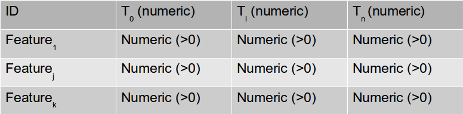

About TrajPop
---------------

TrajPop is a tool that has been developed in the ERC [GeoDiverCity] project.

It allows user to create clusters of cities according to their temporal population evolution, resulting in clusters of (temporal) **Traj**ectories of **Pop**ulations.

It has been created and is being maintained by [Robin Cura], at public research lab [Géographie-cités].

---------------
User guide
---------------

> For a brief demo of the application possibilities, click on the `load test dataset` button

###### Input

This application expects a plain text document as input (*ie*. a csv or tsv file), following this data formatting as minimal requirement:

Note that it can also contains other variables, such as lat/long data for mapping, or categorical data for correspondence analysis.

Depending on your text format, you might have to check `CSV Import Settings`, which will allow you to configure the application accordingly to your data.

Once a file is loaded, there's 2 needs :
- Defining an `ID column`, that needs to be a unique attribute of each feature.
- Defining a set of `Temporal columns` (**3 minimum**) that will be used to define the clusters.

###### Clusters plots

The plots are computed accordingly to the number of clusters defined with the slider `Number of wanted clusters`. The colors are defined using the `Color palette` selector, and refers to <a href="http://www.cookbook-r.com/Graphs/Colors(ggplot2)/colorbrewer.png" target="_blank">RColorBrewer qualitative palettes</a>. Note that those palettes can only be used for a defined number of colors, so, when trying to draw more colors than the palette allows, the palette choice will be switched to a rainbow palette.

###### Table

The Table panel contains a dynamic version of the originally uploaded table, with the addition of the cluster each feature belongs to. The `Search` function might prove really useful when trying to identify the cluster a city is in. Note that using the `Download Table` button, you can export this increased table, which you'll download as a CSV file.
Please keep in mind that heavy tables can take some time to load, so, don't hesitate looking at other tabs while it's loading.

###### Maps

This tab features two maps of your data, as long as you fill the `Latitude` and `Longitude` inputs, and also the `Scales points on` one. This last argument must be applied on a numeric column, and all the points size will then be computed out of the maximum value of this column, having a maximum radius that can be customized with the `Max. point size` slider. Note that when creating the pdf report, this value will also be used for the static map, so, you might want to configure it for this static output when you'll need to build the report.

###### Correspondence

This tab allows you to perform correspondence analysis on the computed clusters. This means that you can compare the elements composing those clusters to various variables of yours, depending on their `type`.
- When comparing clusters to a **categorical variable**, you should use the **Chi2**. This runs the canonical chi² test, that test the independence of the two compared variables.
- When comparing clusters to a **continuous variable**, you can run an **AN**alysis **O**f **VA**riance. This will render a box-plot representing the distribution of the variable you chose for each of the clusters. Note that when dealing with population data, it might be useful to check the `Log10` box. It sets the Y axis to a log scale. Beside the box-plot, a Fisher-Snedecor (F-test) test is run on the variables, determining also the independence of the variable.

###### Some notes :
- Temporal columns titles must be in numeric format, as they're used to define the x axes of the plots.
- This application runs a **C**orrespondence **A**nalysis on the data, so as hypothesis there can't be any null of negative values inside each temporal column.
- For the mapping process, the app requests latitude and longitude column, on decimal degrees (in WGS84 CRS). For the static map, the used SRC is the spherical Mercator (aka Google Mercator).
- Encoding systems shouldn't be a problem, as it's relying on user system default encoding. If an issue had to happen, consider using files on UTF-8 system.

---------------
Methodology
---------------

TrajPop performs a **Correspondence Analysis** on a temporal population table. The coordinates of cities on the orthogonal components then make it possible, after re-entering the weights of the features, to generate a matrix for population discrepancies amond cities (measured using a chi² distance).
To this matrix is applied a **Hierarchical Cluster Analysis** (using the Ward method, which tends to minimise intra-class variance and to maximise inter-class variance).

From the tree generated by this clustering, the user have to choose a number of clusters that sufficiently distinguishes the trajectories while at the same time enables them to be mapped.
It is then possible to analyse trajectory classes, using the various graphical outputs such as plots and maps.

+ explains the interest, + explains the plots.

---------------
Troubleshooting
---------------

Here are the most common (and easily correctible) sources of errors.
- Data containing negative value **or 0** value.
- Less than 3 columns selected.
- Uses of non standard encoding (use UTF-8 encoded files).
- If categorical variable, be sure to use **Chi2**, else use **ANOVA**.

---------------
Dependencies and technical details
---------------
This application runs on [R], through the use of [Shiny] server.
Here's a list of the packages that allows this result :
- Analysis : [ade4] , [FactoClass] and [reshape]
- Plots : [ggplot2], [RColorBrewer] and [A2R]
- Maps : [webmaps]
- Table : [rCharts]
- Reporting : [knitr]

We'd like to thanks the creator of those packages, and especially the maintainers of Shiny, for their valuables advices and answers.

Contact
---------------

[Robin Cura] [1]

Reference : Robin Cura, (2013). TrajPop (1.0 web version) [Web application]. Retrieved from http://trajpop.parisgeo.cnrs.fr

  [Robin Cura]: http://www.parisgeo.cnrs.fr/spip.php?article6416&lang=en
  [GeoDiverCity]: http://geodivercity.parisgeo.cnrs.fr
  [Géographie-cités]: http://www.parisgeo.cnrs.fr
  [R]: http://www.r-project.org/
  [Shiny]: http://www.rstudio.com/shiny/
  
  [A2R]: http://addictedtor.free.fr/packages/A2R/lastVersion/
  [ade4]: http://cran.r-project.org/web/packages/ade4/
  [FactoClass]: http://cran.r-project.org/web/packages/FactoClass/
  [ggplot2]: http://ggplot2.org/
  [knitr]: http://yihui.name/knitr/
  [rCharts]: http://rcharts.io/
  [RColorBrewer]: http://cran.r-project.org/web/packages/RColorBrewer/
  [reshape]: http://had.co.nz/reshape/
  [webmaps]: https://github.com/RCura/webmaps
  [1]: mailto:robin_dot_cura_AT_gmail_dot_com

 TrajPop v1.0.1 - October 2013 
 Copyright 2013 Robin Cura, [Géographie-cités]
